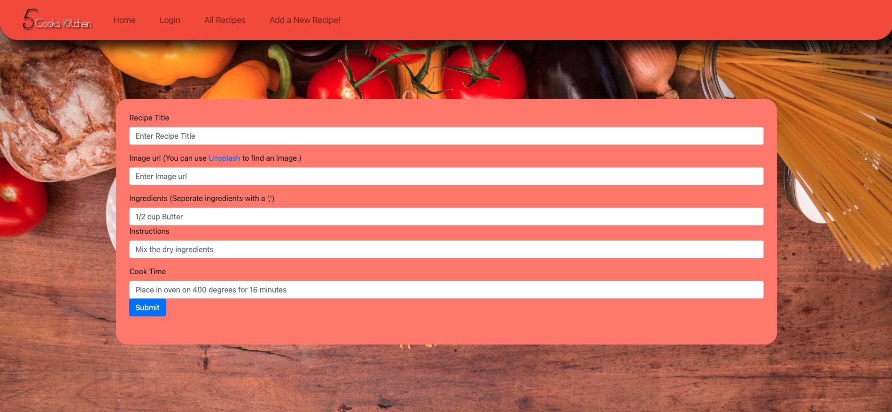

# 5 Cooks in the Kitchen

## Application Link

[5 cooks cookbook](https://agile-shore-26692.herokuapp.com/)

## Description

This application can be used to save recipies. By clicking the 'add new recipe' button, the user will be able to add and image of their food, a title, the ingredients needed, the instructions, as well as the total cook time (in minutes) of the meal. The webpage will also provide a random recipie that the user will be able to save. In order to view the users previously saved recipies, the can simply click on the button titled 'my recipies'. 

## Table of Contents
  1. [Installation Instructions](#installation)
  2. [Usage Information](#usage)
  3. [Contribution Guidelines](#contribution)
  4. [Testing](#testing)
  5. [License information](#Licensing)
 
  ## Installation
  This application requires no installation.
  ## Usage
  In order to use this application, the user will need to log in. From here, the can create reciepes to be saved and view all their previously save recipies. They can also the view the recipie of the day, save it if they want. 
  ## Contribution
  This project was created by:
#### [David Healy](https://github.com/dhealy83)
#### [Jordan Laczkowski](https://github.com/JordanLaczkowski)
#### [Tyler Linch](https://github.com/tjlinch)
#### [Tony Santo](https://github.com/tonymsanto)
#### [Kamary Gillespie](https://github.com/kamarygillespie43)
  ## Testing
  This application has no testing.
  ## Licensing
  This application has no license.
  