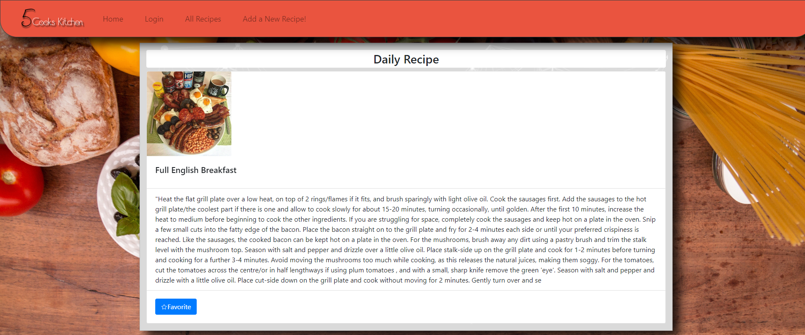
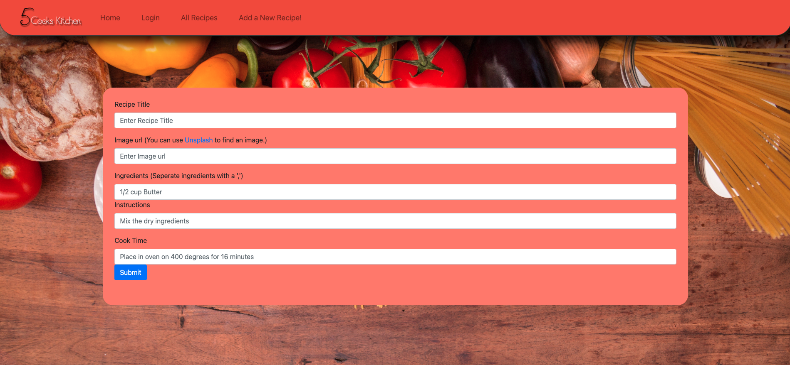

# 5 Cooks in the Kitchen

 

 

 

## Table of Contents

1. [Installation Instructions](#installation)
2. [Usage Information](#usage)
3. [Contributors](#contributors)
4. [Testing](#testing)
5. [License information](#licensing)

## Application Link

[5 cooks cookbook](https://agile-shore-26692.herokuapp.com/)

## Description

This application can be used to save recipes. By clicking the "add new recipe" button, the user will be able to add an image of their food, a title, the ingredients needed, the instructions, as well as the total cook time (in minutes) of the meal. The homepage provides a random recipe that the user will be able to save(function not working currently). In order to view the users previously added recipes, the can simply click on the button titled "my recipes".

## Installation

This application requires no installation.

## Usage

In order to use this application, the user will need to log in. From here, they can create recipes to be added to their cookbook and view all their previously added recipes. They can also view a recipe of the day, in case they need some inspiration for what to cook!

## Contributors

This project was created by:

#### [David Healy](https://github.com/dhealy83)

#### [Jordan Laczkowski](https://github.com/JordanLaczkowski)

#### [Tyler Linch](https://github.com/tjlinch)

#### [Tony Santo](https://github.com/tonymsanto)

#### [Kamary Gillespie](https://github.com/kamarygillespie43)

## Testing

This application has no testing.

## Licensing

This application is not licensed.

## Technologies Used

### Axios:

Axios is a promise-based HTTP Client for node.js and the browser. It is isomorphic (= it can run in the browser and nodejs with the same codebase). On the server-side it uses the native node.js http module, while on the client (browser) it uses XMLHttpRequests.

### Visual Studio Code:

Visual Studio Code is a lightweight but powerful source code editor which runs on your desktop and is available for Windows, macOS and Linux. It comes with built-in support for JavaScript, TypeScript and Node.js and has a rich ecosystem of extensions for other languages and runtimes (such as C++, C#, Java, Python, PHP, Go, .NET). Begin your journey with VS Code with these introductory videos.

### NPM:

NPM is the world's largest software registry. Open source developers from every continent use npm to share and borrow packages, and many organizations use NPM to manage private development as well.

## Particle.js

A lightweight, dependency-free and responsive javascript plugin for particle backgrounds.

particles.js is created by Marc Brüderlin and released under the MIT license.

Copyright © 2017 Marc Bruederlin

Permission is hereby granted, free of charge, to any person obtaining a copy
of this software and associated documentation files (the “Software”), to deal
in the Software without restriction, including without limitation the rights
to use, copy, modify, merge, publish, distribute, sublicense, and/or sell
copies of the Software, and to permit persons to whom the Software is
furnished to do so, subject to the following conditions:

The above copyright notice and this permission notice shall be included in
all copies or substantial portions of the Software.

THE SOFTWARE IS PROVIDED “AS IS”, WITHOUT WARRANTY OF ANY KIND, EXPRESS OR
IMPLIED, INCLUDING BUT NOT LIMITED TO THE WARRANTIES OF MERCHANTABILITY,
FITNESS FOR A PARTICULAR PURPOSE AND NONINFRINGEMENT. IN NO EVENT SHALL THE
AUTHORS OR COPYRIGHT HOLDERS BE LIABLE FOR ANY CLAIM, DAMAGES OR OTHER
LIABILITY, WHETHER IN AN ACTION OF CONTRACT, TORT OR OTHERWISE, ARISING FROM,
OUT OF OR IN CONNECTION WITH THE SOFTWARE OR THE USE OR OTHER DEALINGS IN
THE SOFTWARE.
